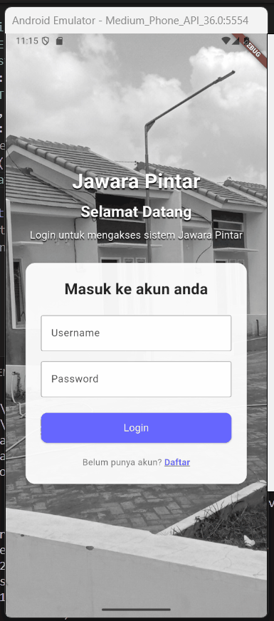

# **Pembagian Fitur:**

| Nama | Fitur | GIF |
|------|--------|-----|
| **Kevin** | data_warga_rumah/warga_daftar_screen.dart   data_warga_rumah/warga_tambah_screen.dart   data_warga_rumah/keluarga_screen.dart   data_warga_rumah/rumah_daftar_screen.dart   data_warga_rumah/rumah_tambah_screen.dart   pengeluaran/pengeluaran_daftar_screen.dart   pengeluaran/pengeluaran_tambah_screen.dart |GIF|
| **Chiko** | pemasukan/kategori_iuran_screen.dart   pemasukan/tagih_iuran_screen.dart   pemasukan/tagihan_screen.dart   pemasukan/pemasukan_lain_daftar_screen.dart   pemasukan/pemasukan_lain_tambah_screen.dart   pesan_warga/informasi_aspirasi_screen.dart | GIF|
| **Rengga** | kegiatan_broadcast/kegiatan_daftar_screen.dart   kegiatan_broadcast/kegiatan_tambah_screen.dart   kegiatan_broadcast/broadcast_daftar_screen.dart   kegiatan_broadcast/broadcast_tambah_screen.dart   log_aktifitas/semua_aktifitas_screen.dart | 
| **Tionusa** | laporan_keuangan/laporan_pemasukan_screen.dart   laporan_keuangan/laporan_pengeluaran_screen.dart   laporan_keuangan/cetak_laporan_screen.dart   penerimaan_warga/penerimaan_warga_screen.dart   mutasi_keluarga/mutasi_daftar_screen.dart   mutasi_keluarga/mutasi_tambah_screen.dart | GIF|
| **Attadewa** | pengeluaran/pengeluaran_daftar_screen.dart   pengeluaran/pengeluaran_tambah_screen.dart   manajemen_pengguna/pengguna_daftar_screen.dart   manajemen_pengguna/pengguna_tambah_screen.dart   channel_transter/channel_daftar_screen.dart   channel_transter/channel_tambah_screen.dart | GIF|
| **Raul** | auth/login_screen.dart   auth/register_screen.dart   dashboard/keuangan_screen.dart   dashboard/kegiatan_screen.dart   dashboard/kependudukan_screen.dart | 
